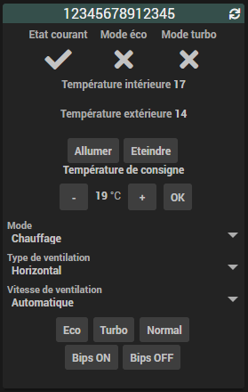
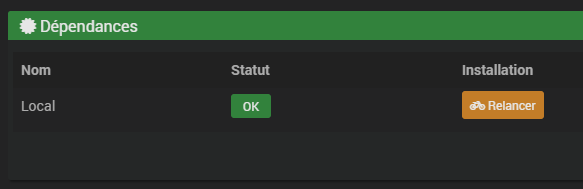
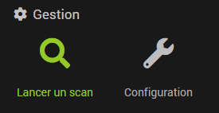
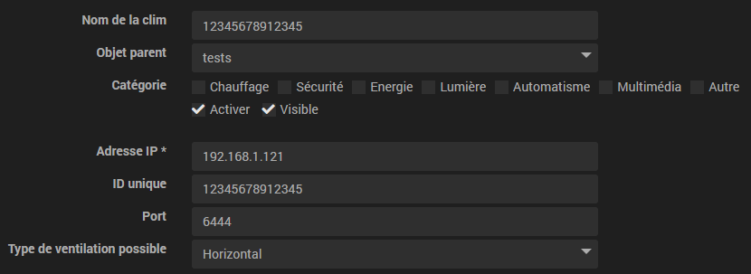

# Plugin Mideawifi

Mideawifi permet de contrôler et historiser les informations de climatiseurs construits par **[Midea](https://fr.wikipedia.org/wiki/Midea)** avec modules Wi-Fi. 
Si vous utilisez l'application smartphone **Nethome plus**, c'est probablement le constructeur Midea qui est derrière le contrôleur de climatiseur.  

Voici une liste non exhaustive de marques ayant parfois des contrôleurs électroniques Midea:  
- Altech  
- Carrier  
- Johnson  
- Riello  

## Aperçu  

# Configuration générale

Il faut tout d'abord installer les dépendances pour que le plugin fonctionne correctement.  

Lorsque c'est **OK**, vous pouvez cliquer sur Lancer un scan, bouton par défaut sur l'accueil du plugin.  

> Attention! Vous devez au préalable avoir connecté votre ou vos climatiseur(s) au réseau wi-fi et vérifié le bon fonctionnement avec l'application Smartphone.  

Vous pouvez visualiser le ou les équipements trouvés et cliquer pour rentrer dans leurs configurations.

# Configuration d'un équipement

  
En plus des réglages habituels de tous les équipements, vous pourrez modifier le port si ce n'est pas celui par défaut et aussi bloquer le type de ventilation pour n'avoir que les choix compatibles avec votre matériel sur l'affichage dashboard. L'ID et l'IP ne sont pas modifiables.

# FAQ
- Je ne trouve aucune clim
    => Merci de vérifier avec une appli smartphone (*Midea Air* ou *NetHome Plus* par exemple) si ça fonctionne ou non.  
    => L'association au réseau wifi doit être effectuée au préalable.  
    => Le module du climatiseur est peut être planté, il faut redémarrer la clim et la contrôler avec la télécommande pour qu'elle s'initialise correctement.  

- La clim ne répond plus aux commandes et les informations ne sont plus à jour  
    => Comme indiqué sur la page des équipements, il est **vivement conseillé** de fixer les adresses IP de vos appareils. Si vous relancez un scan, l'IP se mettre à jour d'elle même sur les équipements existants.  
    => Toujours vérifier avec une application smartphone si ça fonctionne, c'est très souvent la clim qui ne répond tout simplement plus et il faut la redémarrer.  

- Lors du scan, j'ai une ou plusieurs clims avec un message m'indiquant qu'elle n'est peut-être pas supportée
	=> Le script tiers renvoi une information quand il n'arrive pas à décrypter/analyser correctement toutes les informations venant de l'appareil en question, vous pouvez tester, ça peut quand même fonctionner mais sans garanties.

# Scripts Tiers

Mideawifi repose sur le script tiers python **msmart** en version *0.1.23*  
Vous pouvez trouver le code github original ici:  [mac-zhou/msmart](https://github.com/mac-zhou/midea-msmart/)

# Informations complémentaires

 - Le plugin n'a pas été testé avec tous les climatiseurs et avec toutes les configurations logicielles et réseaux.  
 Merci de faire un Issue sur [GitHub](https://github.com/ddelec24/mideawifi/issues) ou un message sur le forum [Community Jeedom](https://community.jeedom.com/) si jamais vous constatez un dysfonctionnement.

# License

GPL-2.0